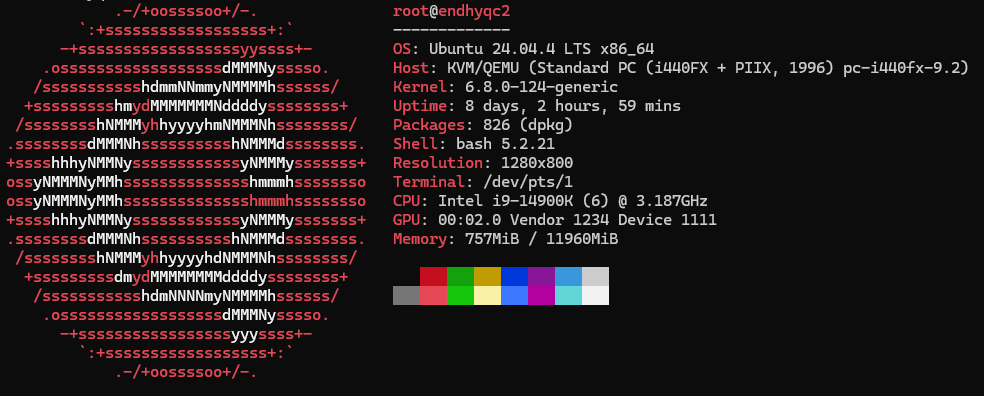
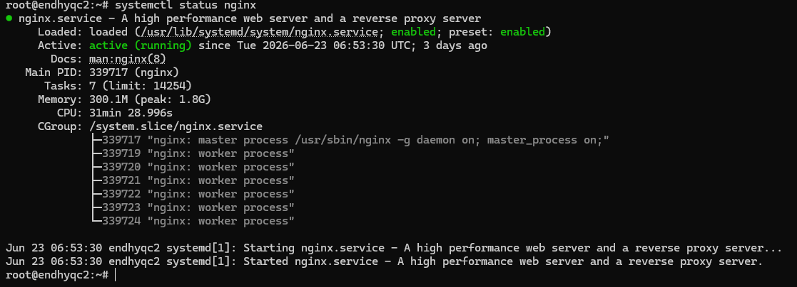
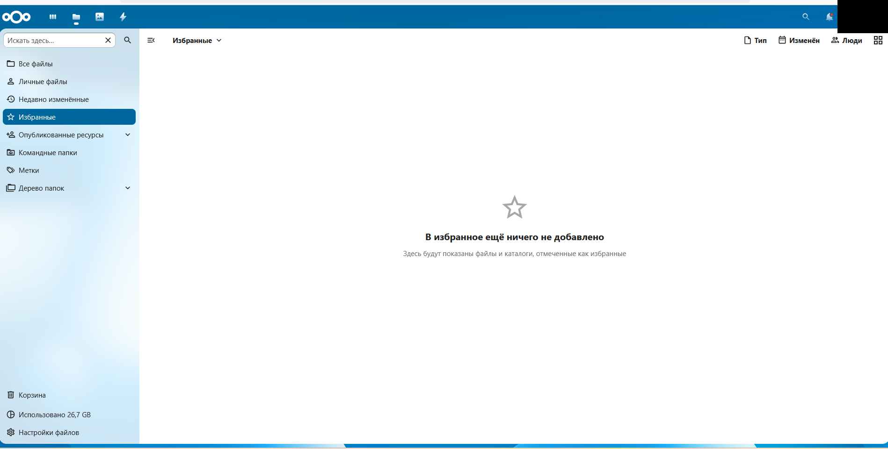
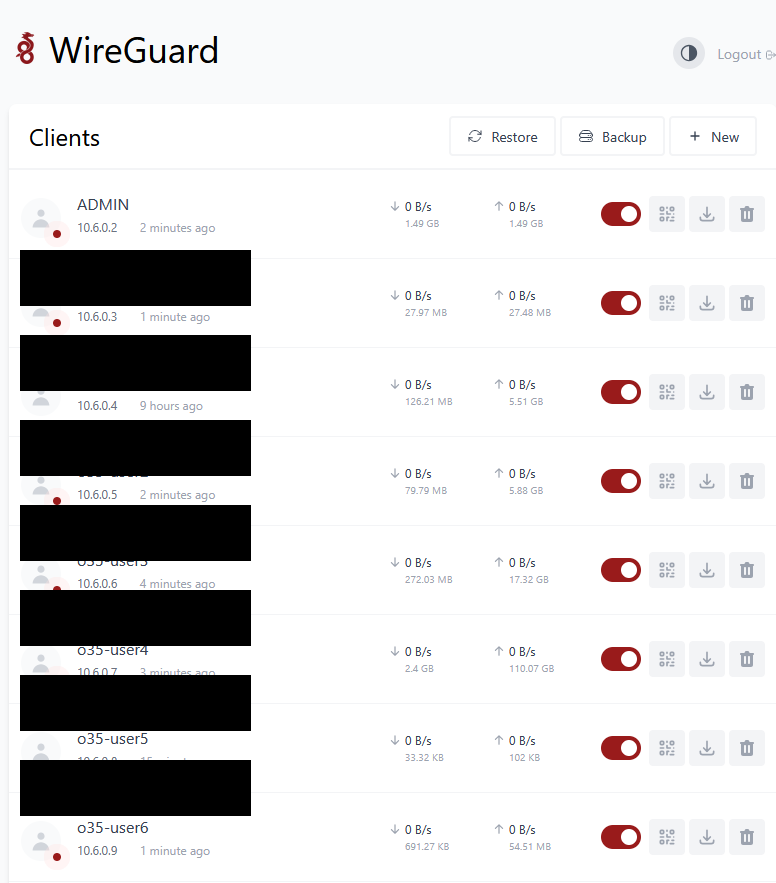
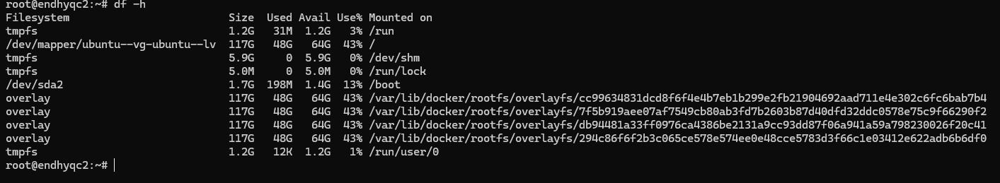
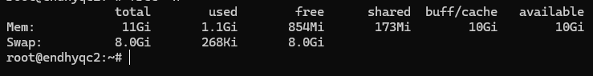

# Ubuntu VPS Infrastructure

## Overview

This repository documents my self-hosted Ubuntu VPS infrastructure.

The server runs a Docker-based Nextcloud stack with PostgreSQL and Redis, protected behind an Nginx reverse proxy with HTTPS.

WireGuard and wg-easy provide secure remote access and VPN client management.

This project represents practical experience with Linux administration, Docker, networking, reverse proxy configuration, SSL, VPN deployment and infrastructure troubleshooting.

---

## Architecture

```text
                 Internet
                      │
               DuckDNS Domain
                      │
            Let's Encrypt SSL
                      │
                  Nginx
                      │
              127.0.0.1:8080
                      │
                 Nextcloud
                  │       │
             PostgreSQL  Redis

             WireGuard VPN
                    │
                 wg-easy
                    │
              Remote Clients
```

---

## Technology Stack

- Ubuntu Server 24.04 LTS
- Docker
- Docker Compose
- Nextcloud
- PostgreSQL 16
- Redis 7
- Nginx
- Let's Encrypt
- WireGuard
- wg-easy

---

## Repository Structure

```text
ubuntu-vps/
├── docker-compose.yml
├── docs/
│   ├── architecture.md
│   └── security.md
├── nginx/
│   └── nextcloud.conf
├── scripts/
│   ├── update.sh
│   └── restart-stack.sh
├── screenshots/
│   ├── server-overview.png
│   ├── server-services.png
│   ├── nextcloud-dashboard-redacted.png
│   ├── wireguard-ui-redacted.png
│   ├── disk-usage.png
│   └── memory-usage.png
└── README.md
```

---

## Screenshots

### Server Overview



---

### Running Services



---

### Nextcloud Dashboard



---

### WireGuard VPN



---

### Disk Usage



---

### Memory Usage



---

## Key Features

- Self-hosted Ubuntu VPS
- Docker-based infrastructure
- Nextcloud cloud storage
- PostgreSQL database
- Redis caching
- Nginx reverse proxy
- HTTPS using Let's Encrypt
- Local-only container exposure (`127.0.0.1:8080`)
- Secure remote access with WireGuard
- VPN client management with wg-easy
- Infrastructure automation scripts

---

## What I Built

I built and maintain a self-hosted Ubuntu VPS environment for running production-like infrastructure services.

The core service is Nextcloud running in Docker with PostgreSQL and Redis.

Nginx works as a reverse proxy, exposing the application securely over HTTPS while keeping the container available only through the local interface.

WireGuard and wg-easy provide secure remote administration and VPN access.

I also created automation scripts for infrastructure maintenance and updates.

---

## What I Learned

- Linux server administration
- Docker Compose deployment
- Container networking
- Reverse proxy configuration
- SSL certificate management
- VPN deployment
- Docker troubleshooting
- Infrastructure documentation
- Production-style service management

---

## Security

Sensitive information has been removed from this repository.

The following data is replaced before publishing:

- Real domain names
- Public IP addresses
- Database passwords
- Private keys
- Tokens
- SSL certificates
- Secrets

---

## Future Improvements

- Automated backups
- Monitoring with Grafana
- Prometheus metrics
- CI/CD deployment
- Infrastructure as Code
- Automatic health checks
